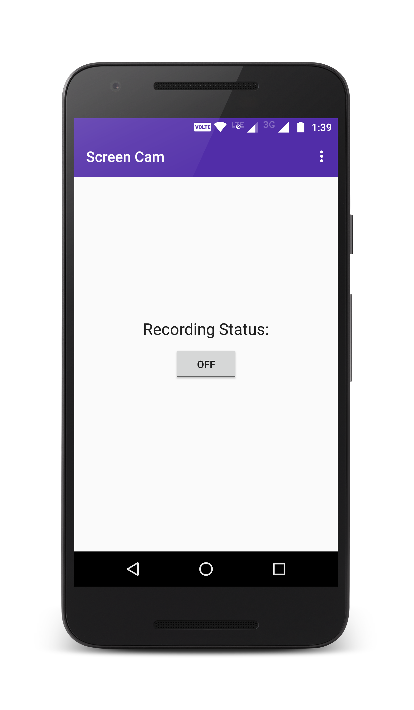
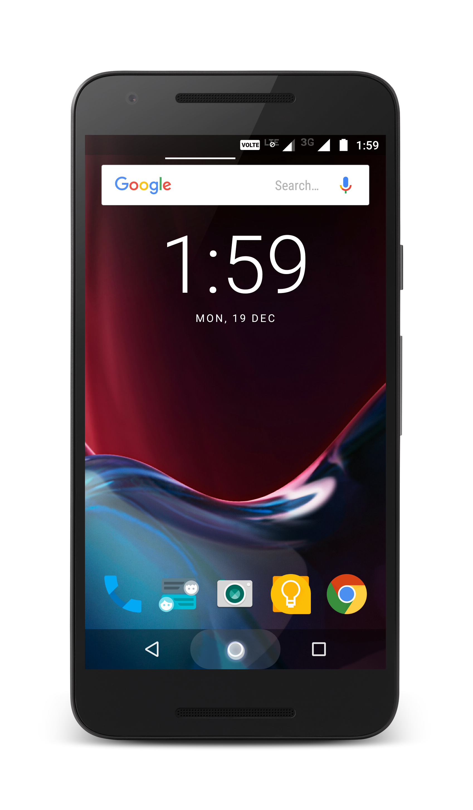
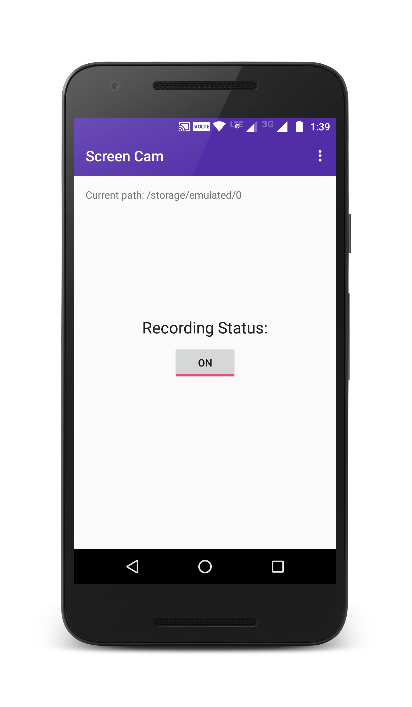
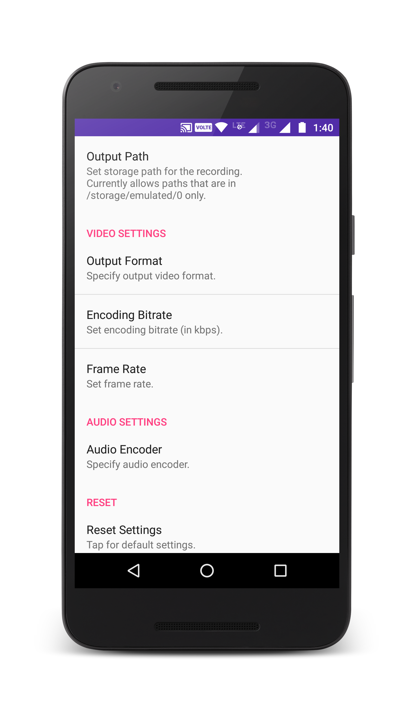

# ScreenCam
A simple android app that captures video of the phone's screen (ie. screencast app) and records the external audio.

## Download
Download app from [here](https://github.com/DevipriyaSarkar/ScreenCam/releases).

## How to use?
1. [Download](https://github.com/DevipriyaSarkar/ScreenCam/releases) the apk
2. Install the apk and click on the toggle button to start recording  
	  
3. Minimize the app by pressing the device home button (Do **not** press device back button) 
	
4. Perform the actions you want to record
5. Go back to the app and press the toggle button again to stop recording  
	  
	**NOTE - The "current path" shown at the top of the screen when the recording starts is the path where your current recording will be saved.**
6. [Optional] Tweak audio/video settings in the Settings to optimize audio/video quality according to your device
	

## License
The content of this repository is licensed under [MIT LICENSE](LICENSE).
